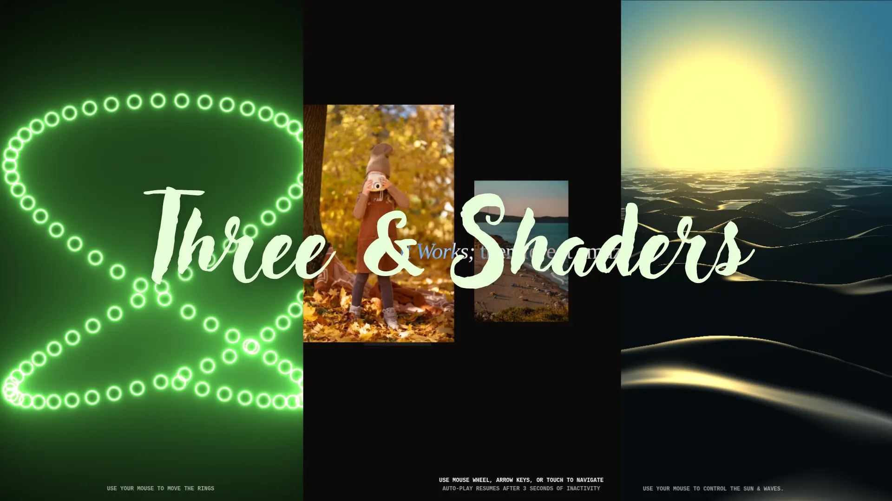

# Three Shaders Collection



Explore interactive WebGL shaders built with **Three.js** and **React**. This project features three unique experiences:

1. **Axel Rings**
   Interactive concentric rings that respond to mouse movement, allowing you to control speed, spacing, and color transitions.

2. **Sunset Raymarch**
   A dynamic sunset scene over the sea, where the sun position, lighting, and wave effects can be controlled with the mouse.

3. **Infinite Gallery**
   An infinite image scroll gallery powered by shaders, with smooth transitions, blur effects, and live interactions.

---

## Live Demo

Check out the live version: [Three Shaders Collection](https://three-shaders-collection.netlify.app/)

---

## Technologies Used

- **Three.js** – 3D WebGL rendering
- **React** – UI and state management
- **React Three Fiber** – Integrating Three.js with React
- **Shaders** – Custom GLSL shaders for effects

---

## Getting Started

1. Clone the repo:

```bash
git clone git@github.com:mudgalz/three-shaders-collection.git
```
